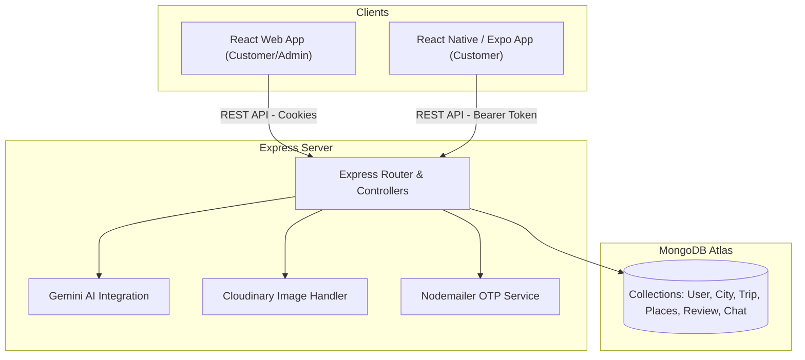

# Tài liệu 01: Giới thiệu Tổng quan & Kiến trúc Dự án TravelLako

Chào mừng các bạn Frontend Developer (Web & Mobile) tham gia phát triển dự án **TravelLako** - Hệ thống tư vấn, quản lý và tự động tối ưu hóa lịch trình du lịch thông minh.

Tài liệu này cung cấp cái nhìn tổng quan về hệ thống, kiến trúc ứng dụng và cơ chế xác thực (Authentication Flow) để bắt đầu xây dựng FE.

---

## 1. Giới thiệu Dự án
**TravelLako** là một nền tảng hỗ trợ người dùng khám phá các địa điểm du lịch, ẩm thực, giải trí và lập kế hoạch di chuyển tối ưu:
*   **Customer (Khách hàng):** Khám phá danh thắng, khách sạn, nhà hàng, quán cafe; yêu thích địa điểm; lên lịch trình chuyến đi; trò chuyện trực tiếp với trợ lý ảo AI để được đề xuất và tối ưu hóa đường đi ngắn nhất.
*   **Admin (Quản trị viên):** Quản trị danh sách người dùng, thành phố, địa điểm du lịch; xem biểu đồ thống kê tăng trưởng; import dữ liệu hàng loạt.

---

## 2. Kiến trúc Hệ thống (System Architecture)
Hệ thống được phát triển theo mô hình **Client-Server** giao tiếp qua giao thức RESTful API.



---

## 3. Luồng xác thực người dùng (Authentication Flow)

Dự án sử dụng cơ chế bảo mật **JWT (JSON Web Token)** để xác thực quyền truy cập qua hai hình thức khác nhau tùy vào nền tảng thiết bị:

### A. Dành cho Web Frontend (React + Vite)
Để đảm bảo an toàn tuyệt đối chống tấn công XSS, Backend sử dụng **HTTP-Only Cookie** để lưu trữ JWT Token.
*   **Khi đăng nhập thành công (`POST /api/auth/login`):** Backend tự động ghi đè token vào cookie của trình duyệt (`jwt` cookie) với tùy chọn `httpOnly: true`.
*   **Khi gọi các API cần quyền hạn (ví dụ: lấy thông tin cá nhân, cập nhật chuyến đi):** Trình duyệt sẽ tự động gửi kèm cookie này.
*   **Yêu cầu tích hợp ở FE:**
    *   Bạn **bắt buộc** phải cấu hình Axios (hoặc Fetch) với thuộc tính `withCredentials: true` trên tất cả các request để cookie được gửi đi một cách tự động.
    ```typescript
    import axios from 'axios';
    const api = axios.create({
      baseURL: 'http://localhost:5000/api',
      withCredentials: true, // Cực kỳ quan trọng
    });
    ```

### B. Dành cho Mobile App (React Native / Expo)
Môi trường ứng dụng di động không hỗ trợ tự động xử lý Cookie HTTP-Only giống trình duyệt. Do đó, cơ chế xác thực sẽ thông qua Headers.
*   **Khi đăng nhập thành công:** Phản hồi từ Backend sẽ đính kèm thông tin token trong body (hoặc bạn có thể yêu cầu dev backend hỗ trợ trả token trực tiếp ở response body nếu chạy môi trường App).
*   **Gửi Request từ App:** Gửi kèm token trong header `Authorization`.
    ```text
    Authorization: Bearer <your_jwt_token>
    ```
*   **Yêu cầu tích hợp ở App:**
    *   Sử dụng `expo-secure-store` để lưu JWT Token vào bộ nhớ bảo mật Keychain (iOS) / Keystore (Android) khi đăng nhập thành công.
    *   Tự cấu hình Axios interceptor để gán token vào Header trên mỗi request đi từ app.

### C. Quy trình Xác thực tài khoản bằng OTP (Email Verification)
Hệ thống sử dụng cơ chế bảo mật 2 lớp đăng ký bằng mã OTP qua Email:
1.  Người dùng điền thông tin đăng ký (`/api/auth/register`).
2.  Backend tạo tài khoản ở trạng thái chưa kích hoạt (`isVerified: false`), đồng thời gửi mã OTP 6 số qua email đăng ký của người dùng thông qua dịch vụ Nodemailer.
3.  FE chuyển hướng người dùng đến màn hình nhập mã OTP.
4.  Người dùng nhập OTP và FE gửi yêu cầu xác thực (`/api/auth/verify-otp`).
5.  Xác thực thành công -> Backend cập nhật `isVerified: true`, đăng nhập và cấp quyền truy cập chính thức.

---

## 4. Danh sách Công nghệ & Thư viện Đề xuất (Tech Stack & Packages)

Dưới đây là danh sách chi tiết các công nghệ và thư viện đề xuất cho cả Web Frontend và Mobile App để đảm bảo hiệu năng cao, giao diện mượt mà và tương thích tốt nhất với API Backend:

### A. Dành cho Web Frontend (React + Vite + TypeScript)

#### 1. Bộ khung & Cấu trúc cơ bản
*   **Vite**: Trình build nhanh chóng, tối ưu hóa quá trình phát triển (Hỗ trợ HMR siêu tốc).
*   **TypeScript**: Đảm bảo an toàn kiểu dữ liệu (Type-safe) khi kết nối với các interfaces dữ liệu ở Tài liệu 02.
*   **`react-router-dom`**: Quản lý định tuyến và phân trang SPA (Home, Login, Register, Trips, Detail, Admin Dashboard).
*   *Lệnh cài đặt:*
    ```bash
    npm install react-router-dom
    ```

#### 2. Kết nối API & Quản lý State
*   **`axios`**: Trực quan hóa việc gửi request. Cần cấu hình `{ withCredentials: true }` để tự động đính kèm cookie.
*   **`@tanstack/react-query`**: Quản lý lưu trữ đệm (caching), tự động lấy lại dữ liệu khi người dùng chuyển tab hoặc mất mạng, và quản lý các trạng thái tải dữ liệu (`isLoading`, `isError`).
*   **`zustand`**: Quản lý global state siêu nhẹ, tối ưu cho TypeScript, dùng để lưu trữ thông tin User đang đăng nhập hoặc cài đặt UI.
*   *Lệnh cài đặt:*
    ```bash
    npm install axios @tanstack/react-query zustand
    ```

#### 3. Thiết kế & Hiệu ứng Giao diện (UI/UX)
Các thư viện và quy chuẩn thiết kế giao diện được trình bày chi tiết trong **[Tài liệu 06: Design System](06_Design_System.md)**.
*   *Lệnh cài đặt các gói UI/UX:*
    ```bash
    npm install -D tailwindcss postcss autoprefixer
    npx tailwindcss init -p
    npm install lucide-react framer-motion sonner
    ```

#### 4. Tính năng Bản đồ & Lập kế hoạch
*   **`leaflet` & `react-leaflet`**: Bản đồ miễn phí hiển thị tọa độ các địa điểm du lịch của thành phố trên bản đồ dạng vệ tinh hoặc đường phố.
*   **`@hello-pangea/dnd`**: Thư viện hỗ trợ tính năng kéo thả Timeline để sắp xếp thứ tự đi của địa điểm trong ngày.
*   **`date-fns`**: Thư viện thao tác, định dạng ngày tháng tiện lợi.
*   *Lệnh cài đặt:*
    ```bash
    npm install leaflet react-leaflet @hello-pangea/dnd date-fns
    npm install -D @types/leaflet
    ```

#### 5. Form & Validation dữ liệu
*   **`react-hook-form`**: Tối ưu hóa việc nhập liệu form đăng nhập, đăng ký, viết đánh giá mà không gây re-render ứng dụng liên tục.
*   **`zod` & `@hookform/resolvers`**: Kiểm tra định dạng dữ liệu (Email, Mật khẩu, Số điện thoại...) ngay tại Frontend và tự động xuất ra lỗi trước khi gửi lên API.
*   *Lệnh cài đặt:*
    ```bash
    npm install react-hook-form zod @hookform/resolvers
    ```

#### 6. Biểu đồ Admin Dashboard
*   **`recharts`**: Vẽ biểu đồ thống kê dạng cột, tròn, đường một cách trực quan bằng SVG.
*   *Lệnh cài đặt:*
    ```bash
    npm install recharts
    ```

---

### B. Dành cho Mobile App (React Native / Expo + TypeScript)

#### 1. Bộ khung & Điều hướng
*   **Expo**: Công cụ phát triển React Native tốt nhất hiện nay, cung cấp sẵn các API truy cập phần cứng và môi trường build đám mây (EAS).
*   **`expo-router`**: Định tuyến dựa trên thư mục giống như Next.js, tối ưu hóa các tab điều hướng di động.
*   *Lệnh cài đặt:*
    ```bash
    npx expo install expo-router react-native-safe-area-context react-native-screens
    ```

#### 2. Styling di động
Các công cụ styling và quy chuẩn thiết kế UI trên Mobile được trình bày chi tiết trong **[Tài liệu 06: Design System](06_Design_System.md)**.
*   *Lệnh cài đặt các gói Styling:*
    ```bash
    npm install nativewind react-native-paper
    ```

#### 3. API, State & Lưu trữ Bảo mật (Secure Store)
*   **`expo-secure-store`**: Lưu trữ bảo mật JWT Token vào ổ cứng điện thoại dưới dạng mã hóa (Keychain/Keystore) để tự động đăng nhập khi mở app.
*   **Axios & React Query & Zustand**: Tương tự như phiên bản Web để gọi và đồng bộ API.
*   *Lệnh cài đặt:*
    ```bash
    npx expo install expo-secure-store
    npm install axios @tanstack/react-query zustand
    ```

#### 4. Định vị GPS & Bản đồ Mobile
*   **`expo-location`**: Lấy tọa độ định vị GPS hiện tại của người dùng để so khớp khoảng cách check-in địa điểm du lịch (khoảng cách dưới 200m).
*   **`react-native-maps`**: Nhúng trực tiếp bản đồ Google Maps (Android) hoặc Apple Maps (iOS) để ghim vị trí địa điểm.
*   *Lệnh cài đặt:*
    ```bash
    npx expo install expo-location react-native-maps
    ```

#### 5. Camera & Chọn ảnh từ Album (Nhật ký chuyến đi)
*   **`expo-image-picker`**: Cung cấp giao diện để người dùng chọn ảnh từ thư viện hoặc mở camera chụp ảnh mới để tải lên nhật ký chuyến đi.
*   *Lệnh cài đặt:*
    ```bash
    npx expo install expo-image-picker
    ```

