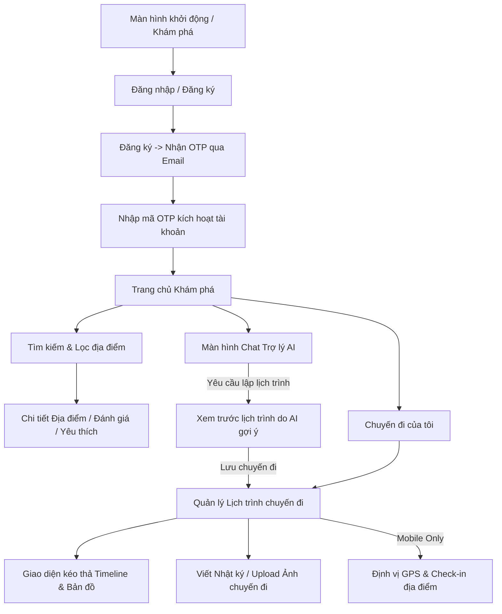

# Tài liệu 03: Sơ đồ Luồng Giao diện (UI Flow) & Các tính năng

Tài liệu này hướng dẫn chi tiết sơ đồ luồng hoạt động của các màn hình và tính năng chính trong hệ thống TravelLako trên cả nền tảng **Web** và **Mobile App**.

---

## 1. Phân hệ Khách hàng (Customer - Web & Mobile)

Luồng giao diện của Khách hàng tập trung vào 3 cốt lõi: Khám phá -> Lập kế hoạch -> Lưu giữ kỷ niệm.

### A. Luồng Đăng ký & Xác thực OTP
1.  Người dùng điền Form đăng ký (Tên, Email, Mật khẩu).
2.  Sau khi ấn "Đăng ký", hiển thị màn hình **"Xác minh tài khoản"** với ô nhập 6 số OTP. Hệ thống hiển thị đồng hồ đếm ngược 60 giây và nút "Gửi lại mã OTP" nếu quá hạn.
3.  Nhập đúng OTP -> Tự động đăng nhập và đưa người dùng về **Trang chủ**.

### B. Màn hình Khám phá & Chi tiết Địa điểm
*   **Trang chủ:** Hiển thị danh sách các thành phố nổi bật (Đà Nẵng, Hà Nội, Hội An...). Bên cạnh đó có ô tìm kiếm nhanh địa điểm theo tên hoặc theo loại (`Attraction`, `Hotel`, `Restaurant`, `Cafe`).
*   **Trang chi tiết Địa điểm:**
    *   Hiển thị thư viện ảnh (dạng Carousel/Grid).
    *   Mô tả chi tiết, giá tiền tham khảo, địa chỉ, bản đồ hiển thị điểm ghim (Marker).
    *   Phần Đánh giá (Reviews): Cho phép người dùng đã đăng nhập đánh giá sao (1-5★) và bình luận. Hiển thị điểm đánh giá trung bình.
    *   Nút trái tim Yêu thích (Favorite): Bật/Tắt để lưu địa điểm vào danh sách yêu thích cá nhân.

### C. Giao diện Lập kế hoạch Chuyến đi (Trip Planner)
Đây là màn hình đòi hỏi tính tương tác cao nhất ở FE:
*   **Tạo chuyến đi mới:** Chọn thành phố, ngày đi, ngày về, ngân sách. Hệ thống tự tạo số lượng ngày trống (Ví dụ: 3 ngày thì tạo Day 1, Day 2, Day 3).
*   **Giao diện Timeline chia đôi màn hình (Web) hoặc Dạng tab (Mobile):**
    *   **Bên trái/Tab 1 (Timeline):** Hiển thị danh sách các địa điểm theo chiều dọc thời gian. FE sử dụng thư viện **Drag & Drop** để người dùng kéo thả thay đổi thứ tự đi của địa điểm trong ngày. Khi thả ra, FE gọi API `PUT /api/trips/:id/schedule/reorder` để cập nhật thứ tự mới.
    *   **Bên phải/Tab 2 (Bản đồ):** Hiển thị bản đồ Leaflet/Google Maps. Khi người dùng click vào một địa điểm ở Timeline, bản đồ sẽ tự động zoom tới địa điểm đó. FE nên vẽ các đường nối (Polyline) theo thứ tự địa điểm từ 0 -> 1 -> 2 để biểu thị tuyến đường di chuyển trong ngày.
    *   **Tính năng Tối ưu lộ trình (AI Optimize):** Một nút bấm "Tối ưu hóa đường đi bằng AI". Khi ấn, FE gọi API `/api/ai/optimize/:tripId` gửi tọa độ của các địa điểm trong ngày lên AI. AI sẽ sắp xếp lại thứ tự di chuyển ngắn nhất và trả về thứ tự mới cho FE cập nhật lại giao diện.

### D. Trợ lý ảo AI Chat & Tự động lưu lịch trình
*   Người dùng trò chuyện tự nhiên với Trợ lý AI (như ChatGPT). Trợ lý sẽ gợi ý các địa điểm có đính kèm giá tiền.
*   Khi người dùng yêu cầu: *"Hãy lập lịch trình du lịch Hà Nội 3 ngày ngân sách 3 triệu"*, AI sẽ trả về một lịch trình dạng chữ (Markdown).
*   **Tính năng "Tự động Lưu Lịch trình từ Đoạn Chat":**
    *   FE hiển thị nút bấm **"Lưu lịch trình này"** ngay dưới câu trả lời của AI.
    *   Khi người dùng bấm nút, FE gửi nội dung đoạn chat Markdown lên API `/api/ai/suggest` với tham số `isParse: true`. Backend sẽ chuyển đoạn text Markdown đó thành một cấu trúc dữ liệu JSON chuẩn (`City`, `startDate`, `endDate`, các `placeId` thực tế của hệ thống).
    *   FE nhận kết quả JSON này và hiển thị màn hình tạo chuyến đi có sẵn thông tin để người dùng lưu vào tài khoản chỉ với 1 click.

### E. Màn hình Nhật ký chuyến đi (Post-trip Diary)
*   Sau khi chuyến đi kết thúc (ngày hiện tại lớn hơn `endDate`), FE hiển thị gợi ý viết Nhật ký chuyến đi.
*   Giao diện gồm ô Textarea viết ghi chú cảm nhận và vùng kéo thả hình ảnh để tải lên (Upload tối đa 10 ảnh thông qua API upload ảnh lên Cloudinary).

### F. Tính năng Check-in địa điểm thực tế (Chỉ có trên Mobile App)
*   Trên màn hình Timeline lịch trình trên app di động, cạnh mỗi địa điểm du lịch sẽ có một biểu tượng Check-in dạng nút bấm.
*   Khi bấm nút Check-in:
    1.  App sử dụng `expo-location` để xin quyền truy cập định vị và lấy tọa độ GPS hiện tại (vĩ độ, kinh độ) của điện thoại.
    2.  Tính khoảng cách giữa tọa độ GPS của người dùng với tọa độ GPS của địa điểm (đã được lưu trong dữ liệu địa điểm).
    3.  Nếu khoảng cách **dưới 200 mét**, App thông báo check-in thành công và gửi API `/api/trips/:id/schedule/places/:subId/check-in` với `{ visited: true }` lên Server.
    4.  Nếu khoảng cách **quá 200 mét**, hiển thị thông báo: *"Bạn chưa đến đúng vị trí của địa điểm này để thực hiện check-in!"*.

---

## 2. Phân hệ Quản trị viên (Admin Portal - Web Chỉ định)

### A. Dashboard Thống kê (Analytics Dashboard)
Trang chính khi Admin đăng nhập:
*   FE sử dụng thư viện `recharts` hiển thị các thông số tổng quan dưới dạng thẻ (Card): Tổng số người dùng, tổng số review, tổng số địa điểm.
*   Biểu đồ đường (Line Chart): Lượng người dùng đăng ký mới theo thời gian.
*   Biểu đồ hình tròn (Pie Chart): Tỷ lệ các loại địa điểm (`Attraction`, `Hotel`, `Restaurant`, `Cafe`).
*   Biểu đồ cột (Bar Chart): Top 5 địa điểm có điểm đánh giá rating cao nhất.

### B. Quản lý Thành phố và Địa điểm (CRUD Management)
*   Danh sách dạng Table có phân trang, tìm kiếm và bộ lọc.
*   Form tạo mới/chỉnh sửa thành phố và địa điểm có tích hợp bản đồ. Admin có thể click chọn vị trí trực tiếp trên bản đồ để lấy tọa độ `lat` và `lng` tự động điền vào Form nhập liệu.
*   Tải lên hình ảnh địa điểm (kéo thả hình ảnh lên Cloudinary).

### C. Quản lý Người dùng & Khóa tài khoản
*   Admin xem danh sách toàn bộ người dùng, tìm kiếm theo tên hoặc email.
*   Nút bấm Khóa/Mở khóa tài khoản (`isBlocked: true/false`) của người dùng vi phạm tiêu chuẩn cộng đồng.

### D. Công cụ Import dữ liệu hàng loạt
*   Màn hình cho phép Admin kéo thả tệp Excel (.xlsx) hoặc JSON chứa hàng trăm địa điểm du lịch, khách sạn đã soạn sẵn từ trước.
*   FE gửi tệp này lên API `/api/admin/import` để backend tự động bóc tách và chèn hàng loạt vào cơ sở dữ liệu.
